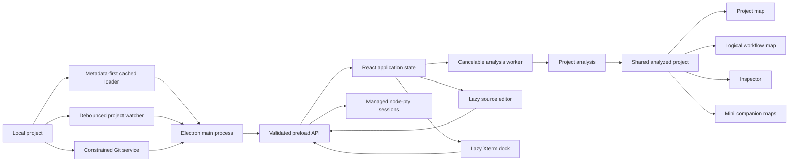

# Architecture

Divex is a desktop React renderer hosted by Electron. The design keeps file and
process permissions outside React, keeps analysis separate from rendering, and
keeps each major user feature in its own directory.

## System overview



## Directory ownership

```text
electron/
├── main.cjs       Native folder scan, file mutations, tasks, and commands
├── git-service.cjs
│                   Status, diffs, staging, and commits using fixed arguments
├── project-loader.cjs
│                   Metadata scan, bounded reads, and content cache
├── project-watcher.cjs
│                   Debounced supported-file change notifications
├── terminal-service.cjs
│                   Owned PTY sessions, input, resize, exit, and cleanup
└── preload.cjs    Narrow window.divex bridge

src/
├── analysis/
│   ├── analysis.worker.ts
│   ├── analyzeProject.ts
│   ├── useAnalyzedProject.ts
│   └── languages/dart.ts
├── app/           Header, sidebar, toolbar, workspace, and UI coordination
├── components/    Shared BrandMark and WorkflowNode components
├── features/
│   ├── editor/
│   ├── explorer/
│   ├── inspector/
│   ├── logic-map/
│   ├── navigation/
│   ├── source-control/
│   ├── terminal/
│   └── project-map/
├── config/
├── data/
├── mini/          Lightweight map-only companion renderer
├── App.tsx
├── styles.css
└── types.ts
```

### Application shell

`src/App.tsx` owns state shared by more than one feature: the active project,
selection, map mode, expansion, zoom, custom positions, editor visibility,
task output, and open menus. Components under `src/app/` compose the visible
regions and receive explicit props.

### Analysis

`analyzeProject` transforms the raw Electron `ProjectPayload` into one
`AnalyzedProject`. Language adapters extract language-specific symbols and
relationships, but return language-neutral types from `src/types.ts`.

Rendering code must not be added to a language adapter. Language-specific
parsing conditions must not be added to map components.

`useAnalyzedProject` sends changed payloads to `analysis.worker.ts`. Only the
newest worker response may replace the active graph; effect cleanup terminates
older workers. The initial built-in demonstration is analyzed synchronously
because it is small and must exist for the first render.

### Project map feature

- `buildVisualGraph.ts` creates folder, file, symbol, containment, and import
  graph data.
- `twoDLayout.ts` creates automatic positions and edge routes.
- `TwoDVisualizer.tsx` manages expansion, viewport interaction, zoom, focus,
  rendering, and manual positions.

### Mini companion renderer

`src/main.tsx` selects `MiniApp` when the Electron URL contains
`mode=mini`. The Mini renderer reuses the shared analysis hook and both map
features without mounting the workbench, editor, inspector, terminal, or source
control.

`project-watcher.cjs` owns recursive filesystem watches in Electron. It ignores
generated/dependency directories, filters unsupported files, combines bursts
of edits into one event, and ties each watch to its requesting `webContents`.
Mini sends those events through the cached loader; unchanged files remain in
memory and only changed contents are read before background graph analysis.

### Logic map feature

- `buildLogicalWorkflowGraph.ts` creates the semantic graph and relation counts.
- `logicalWorkflowLayout.ts` owns layering, cycle handling, crossing reduction,
  spacing, and obstacle-aware edge routing.
- `logicalWorkflowPerformance.ts` owns graph thresholds, working-set budgets,
  filtering, and scoping.
- `LogicalFilterPanel.tsx` owns relationship and protection controls.
- `LogicalWorkflowVisualizer.tsx` owns the viewport, interaction, culling, and
  rendering.

The separation is deliberate: graph meaning, layout math, performance policy,
controls, and DOM rendering can change independently.

### Editor, explorer, and inspector

These are isolated feature folders because each will grow into a larger IDE
subsystem. The editor is dynamically imported; its Ace dependency is in a
separate production chunk and is not required for map-only sessions.

The editor owns one Ace `EditSession` per open path. A session retains its
buffer and undo manager, while Divex stores its last cursor and scroll
positions before activating another tab. Clean documents accept refreshed
project contents; dirty documents retain their local buffer until saved or
explicitly discarded.

`VisualizerWorkspace` keeps the editor subtree mounted after its first use but
hides it while a map is active. This preserves open sessions without loading
Ace during map-only startup. `flutterDiagnostics.ts` is a pure parser that
converts analyzer output into file/line diagnostics before the editor applies
Ace annotations.

### Navigation

`navigationIndex.ts` contains pure file, symbol, text, definition, and reference
lookup. `NavigationPalette.tsx` owns the modal search experience and command
results. `useNavigationHistory.ts` stores a bounded linear history of map or
editor locations.

Navigation results resolve to a path, source line, and optional symbol ID.
`App.tsx` converts that target into the shared selection model and increments an
editor reveal key so choosing the same source line twice still refocuses Ace.
Moving backward or forward applies a stored snapshot without creating another
history entry.

### Source control

`electron/git-service.cjs` is the only layer that launches Git. It validates
the opened root and every relative file path, uses `execFile` with argument
arrays, limits command buffers and timeouts, and returns structured results.
The renderer cannot submit arbitrary Git commands.

`SourceControlPanel.tsx` owns repository status, commit input, staged/working
groups, and bounded diff previews. It reaches the service through narrow
preload methods and reuses `App.tsx` navigation to open changed source files.
The initial surface intentionally excludes destructive discard/reset and
network authentication.

### Integrated terminal and tasks

`terminal-service.cjs` owns every pseudoterminal in the Electron main process.
The renderer may request a project shell, detected task ID, or supported active
file; it cannot provide an arbitrary executable for task/file execution.
Sessions are associated with the requesting `webContents`, capped per owner,
and terminated when that owner is destroyed.

`useIntegratedTerminal.ts` owns lightweight session metadata and routes output
to per-session subscribers. Output is buffered only until Xterm attaches and is
then written directly, avoiding React updates for every process chunk.
`TerminalDock.tsx` owns Xterm instances, fitting, input, session tabs, task
selection, and panel resizing. Both Xterm code and CSS are emitted as a lazy
production chunk.

### Crash containment

`FeatureErrorBoundary` surrounds the active editor or map and also surrounds
the application root. A feature failure replaces only that feature with
recovery controls. `crashReporting.ts` normalizes React, browser, and promise
errors before sending them through the preload bridge.

Electron stores diagnostics as line-delimited JSON under
`app.getPath("userData")/logs/renderer-errors.jsonl`. Reports are length-limited
before writing. Electron also watches for terminated or unresponsive renderer
processes and reloads the first termination with `?safeMode=1`. A second
termination inside the recovery window requires a user decision, preventing an
infinite crash/reload loop.

## Runtime data flow

1. The Electron loader walks folders and collects supported-file paths.
2. Metadata checks reject oversized or unavailable files.
3. Unchanged contents are reused from the three-project LRU cache; changed
   contents are read with bounded concurrency.
4. The preload bridge returns the `ProjectPayload` and streams loading progress.
5. A cancelable worker builds folders, symbols, resolved imports, and semantic
   relationships.
6. Both maps and the inspector read the same immutable analyzed model.
7. Expansion and relationship filters derive temporary visual graphs without
   changing the analyzed model.
8. Editing and desktop commands return through validated preload methods.
9. A successful file save updates the renderer's current project payload and
   starts a new analysis worker.
10. Source-control refreshes read repository metadata independently and never
    modify the analyzed graph until a project file is saved or refreshed.
11. Terminal input, output, resize, and exit events cross narrow IPC methods;
    approved task definitions remain in Electron.
12. Editor documents persist through tab and map changes; only successful
    saves update the shared project payload and start another analysis worker.
13. Divex Mini receives debounced supported-file changes, refreshes through the
    cached loader, and replaces its analyzed map only after the latest worker
    completes.

## Security boundary

The renderer has no unrestricted Node.js access. A desktop operation should
always follow this path:

1. Validate the request in `electron/main.cjs`.
2. Resolve paths inside the opened project root.
3. Expose one narrow method from `electron/preload.cjs`.
4. Add the matching `Window.divex` TypeScript signature.
5. Return a structured success or failure result.

Project writes must continue to use the root-constrained path resolver. Never
accept an arbitrary shell string from a React component.

Crash reports follow the same boundary: the renderer supplies diagnostic text,
the main process truncates it, adds trusted application metadata, and selects
the log path.

## Build boundaries

The normal 2D project map remains in the initial renderer because it is the
default experience. The logic map and editor are lazy features loaded only when
selected. Vite also creates stable React, icon, and editor-engine chunks.

This layout keeps startup smaller while allowing feature folders to become
independent packages or services later.

## Intended IDE evolution

The current in-memory analyzed project is a prototype boundary. A full IDE
should replace it with document, language-service, graph-index, task, terminal,
debug, and test services outside React. See the [IDE roadmap](IDE_ROADMAP.md)
for that target architecture.
