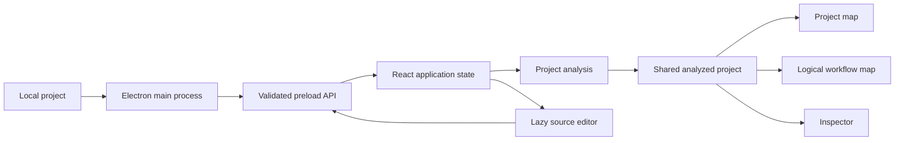

# Architecture

Divex is a desktop React renderer hosted by Electron. The design keeps file and
process permissions outside React, keeps analysis separate from rendering, and
keeps each major user feature in its own directory.

## System overview



## Directory ownership

```text
electron/
├── main.cjs       Native folder scan, file mutations, tasks, and commands
└── preload.cjs    Narrow window.divex bridge

src/
├── analysis/
│   ├── analyzeProject.ts
│   └── languages/dart.ts
├── app/           Header, sidebar, toolbar, workspace, and UI coordination
├── components/    Shared BrandMark and WorkflowNode components
├── features/
│   ├── editor/
│   ├── explorer/
│   ├── inspector/
│   ├── logic-map/
│   └── project-map/
├── config/
├── data/
├── App.tsx
├── styles.css
└── types.ts
```

### Application shell

`src/App.tsx` owns state shared by more than one feature: the active project,
selection, map mode, expansion, zoom, custom positions, editor visibility,
task output, and open menus. Components under `src/app/` compose the visible
regions and receive explicit props.

### Analysis

`analyzeProject` transforms the raw Electron `ProjectPayload` into one
`AnalyzedProject`. Language adapters extract language-specific symbols and
relationships, but return language-neutral types from `src/types.ts`.

Rendering code must not be added to a language adapter. Language-specific
parsing conditions must not be added to map components.

### Project map feature

- `buildVisualGraph.ts` creates folder, file, symbol, containment, and import
  graph data.
- `twoDLayout.ts` creates automatic positions and edge routes.
- `TwoDVisualizer.tsx` manages expansion, viewport interaction, zoom, focus,
  rendering, and manual positions.

### Logic map feature

- `buildLogicalWorkflowGraph.ts` creates the semantic graph and relation counts.
- `logicalWorkflowLayout.ts` owns layering, cycle handling, crossing reduction,
  spacing, and obstacle-aware edge routing.
- `logicalWorkflowPerformance.ts` owns graph thresholds, working-set budgets,
  filtering, and scoping.
- `LogicalFilterPanel.tsx` owns relationship and protection controls.
- `LogicalWorkflowVisualizer.tsx` owns the viewport, interaction, culling, and
  rendering.

The separation is deliberate: graph meaning, layout math, performance policy,
controls, and DOM rendering can change independently.

### Editor, explorer, and inspector

These are isolated feature folders because each will grow into a larger IDE
subsystem. The editor is dynamically imported; its Ace dependency is in a
separate production chunk and is not required for map-only sessions.

### Crash containment

`FeatureErrorBoundary` surrounds the active editor or map and also surrounds
the application root. A feature failure replaces only that feature with
recovery controls. `crashReporting.ts` normalizes React, browser, and promise
errors before sending them through the preload bridge.

Electron stores diagnostics as line-delimited JSON under
`app.getPath("userData")/logs/renderer-errors.jsonl`. Reports are length-limited
before writing. Electron also watches for terminated or unresponsive renderer
processes and reloads the first termination with `?safeMode=1`. A second
termination inside the recovery window requires a user decision, preventing an
infinite crash/reload loop.

## Runtime data flow

1. The Electron process validates and scans a selected root folder.
2. The preload bridge returns a `ProjectPayload` containing supported text
   files.
3. `analyzeProject` builds the folder tree, files, symbols, resolved imports,
   and semantic relationships.
4. Both maps and the inspector read the same immutable analyzed model.
5. Expansion and relationship filters derive temporary visual graphs without
   changing the analyzed model.
6. Editing and desktop commands return through validated preload methods.
7. A successful file save updates the renderer's current project payload.

## Security boundary

The renderer has no unrestricted Node.js access. A desktop operation should
always follow this path:

1. Validate the request in `electron/main.cjs`.
2. Resolve paths inside the opened project root.
3. Expose one narrow method from `electron/preload.cjs`.
4. Add the matching `Window.divex` TypeScript signature.
5. Return a structured success or failure result.

Project writes must continue to use the root-constrained path resolver. Never
accept an arbitrary shell string from a React component.

Crash reports follow the same boundary: the renderer supplies diagnostic text,
the main process truncates it, adds trusted application metadata, and selects
the log path.

## Build boundaries

The normal 2D project map remains in the initial renderer because it is the
default experience. The logic map and editor are lazy features loaded only when
selected. Vite also creates stable React, icon, and editor-engine chunks.

This layout keeps startup smaller while allowing feature folders to become
independent packages or services later.

## Intended IDE evolution

The current in-memory analyzed project is a prototype boundary. A full IDE
should replace it with document, language-service, graph-index, task, terminal,
debug, and test services outside React. See the [IDE roadmap](IDE_ROADMAP.md)
for that target architecture.
