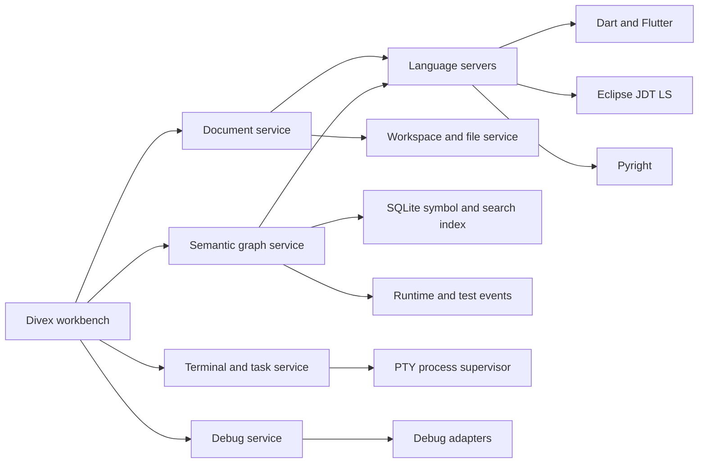

# Divex full IDE roadmap

This roadmap turns Divex from a visual code explorer into a desktop IDE without
losing its beginner-first project and logic maps. The visualizer remains a
client of trusted language services; it must not become the parser, compiler,
or debugger itself.

This is a forward-looking plan. See [Project status](PROJECT_STATUS.md) and
[Features](FEATURES.md) for the current implementation.

## Product promise

Divex should let a beginner answer three questions immediately:

1. Where does this application start?
2. What runs or depends on what?
3. Where should I edit or debug the behavior I am looking at?

Advanced mode should expose the exact file, symbol, source range, diagnostic,
runtime stack, confidence, and provider behind every relationship.

## Target architecture

No file contents, language-server process, terminal process, or index should be
owned by a React component. React renders state obtained from services.

## Architecture decision spike

Before expanding the current shell, build a three-to-four-week proof of concept
with Eclipse Theia:

- brand a desktop Theia application as Divex
- embed the existing project map as a dockable widget
- embed the logical map as a second dockable widget
- select a graph node and open its Monaco model at the exact range
- select code and highlight its graph node
- connect the Dart language server for completion and diagnostics
- run `flutter analyze` in an integrated terminal
- package a macOS test build and measure startup, memory, typing latency, and
  map frame rate

Use Theia if it supports the required Apple-like workbench experience without
fighting its layout model. Otherwise retain the React/Electron shell but keep
the same service boundaries in this document. Do not grow `App.tsx` into the
IDE backend.

## Foundation services

### Workbench

Add a command registry first. Menus, toolbar actions, keyboard shortcuts, the
command palette, and context menus should all execute the same commands. Then
add context keys, keybinding resolution, settings scopes, themes, dockable
panels, editor groups, an activity bar, status bar, notifications, output
channels, and session restore.

### Documents and editor

Replace Ace with Monaco and make URI-based document models the source of truth.
Required behavior:

- multiple tabs and split editor groups
- dirty buffers, preview tabs, pinned tabs, and recently closed tabs
- autosave and explicit save
- encoding and line-ending detection
- external-change conflict handling
- crash recovery and hot exit
- diff editor and navigation history
- breadcrumbs, outline, minimap settings, and diagnostics
- selection, breakpoint, reference, and graph-link decorations

The visual maps must analyze the active unsaved document model, not only the
last version saved to disk.

### Workspace and file service

Stop sending every file and its full contents to the renderer. Scan metadata
incrementally, load file contents on demand, watch changed directories, honor
ignore files, and move parsing/indexing to workers or utility processes. Add
multi-root workspaces only after one-root lifecycle and restore are reliable.

### Language intelligence

Implement an LSP client and start one server per workspace and language:

1. Dart and Flutter through `dart language-server`
2. Java through Eclipse JDT LS
3. Python through Pyright
4. JavaScript and TypeScript after the first three are stable

Completion, hover, definitions, references, rename, document symbols, workspace
symbols, code actions, formatting, diagnostics, semantic tokens, and call
hierarchies must come from the language service when available. Tree-sitter can
provide fast syntax trees and a fallback first graph, but it is not the semantic
source of truth.

### Semantic graph

Persist a language-neutral graph with versioned source evidence.

Node kinds:

- workspace, package, folder, file
- class, interface, mixin, function, method, constructor, variable
- test, build task, runtime frame
- database, schema, table, column
- external package and API

Edge kinds:

- contains, imports, calls, references
- extends, implements, overrides, instantiates
- tests, reads, writes, generates, depends on

Every semantic edge should contain its source URI, source range, target URI,
target range when known, language, provider, confidence, and document version.
The current Dart regex relationships are a prototype provider and must be
replaced or confirmed by language-server or analyzer results.

The logical map should support:

- all-links view with labeled directed edges
- execution-only and architecture-only presets
- per-relationship filters
- one-hop and transitive focus
- incoming and outgoing navigation
- file or package grouping
- saved layouts and automatic re-layout
- a details panel explaining why every edge exists
- comparison of static, runtime, and test-covered links

### Terminal, tasks, and processes

Use xterm.js with node-pty. Add multiple terminals, splits, profiles, resize,
ANSI color, scrollback, search, links, environment display, and lifecycle
restore. A central process supervisor should own terminals, tasks, language
servers, debug adapters, and test processes so closing a React panel cannot
orphan them.

Discover Flutter, Dart, npm, Maven, Gradle, Make, and workspace-defined tasks.
Show structured task output, problem matches, cancellation, history, and
dependencies between tasks.

### Debugging

Implement a generic Debug Adapter Protocol client, then connect:

- Flutter and Dart debug adapters
- Java debugger
- Python debugpy

Add breakpoints, conditional and log breakpoints, stepping, call stacks,
variables, watches, debug console, multi-session support, Flutter hot reload,
and Flutter hot restart. Runtime call events should optionally overlay the
static logical map without overwriting it.

### Search and navigation

Use ripgrep for fast text search and SQLite FTS5 for persistent symbol,
documentation, graph, and later AI retrieval. Add file search, symbol search,
references, call hierarchy, type hierarchy, go to line, recent locations, and
back/forward navigation.

### Source control

Start with the installed Git CLI and parse stable porcelain output. Add status,
diffs, staging, commits, branches, push/pull, merge conflict editing, stash,
history, worktrees, and blame. Repository operations should be commands with
output and cancellation, never direct shell strings assembled in React.

### Testing

Create a test-adapter API with discover, run, debug, cancel, watch, and coverage
operations. Implement Flutter/Dart first, followed by JUnit and pytest. Add a
test explorer, gutter states, failure navigation, output, duration, rerun, and
coverage overlays on both source and the logical graph.

### Extensions

If Theia is selected, use its isolated extension host and Open VSX support. If
the custom shell remains, do not load third-party extension code inside the
renderer. Define permissions, compatibility, activation events, resource
limits, failure isolation, and an allowlist before offering extensions.

### AI assistant

Add AI only after documents, LSP, diagnostics, search, Git, tests, and graph
evidence are stable. A local 3B model is appropriate for beginner explanations,
summaries, and small diagnostic walkthroughs. It is not a parser or compiler.

Provide structured context rather than entire repositories:

- selected URI and range
- related graph neighborhood
- LSP hover, diagnostics, definitions, and references
- relevant search results
- Git diff and test failure

All edits need a diff preview. Tool execution needs explicit permissions.
Secrets must be redacted, workspace instructions treated as untrusted input,
and external network use visible to the user.

### Databases

Begin read-only. Store credentials in the operating-system keychain and model
connections, schemas, tables, columns, indexes, and foreign keys as graph
nodes. Later connect ORM models, queries, migrations, and observed reads/writes
to the semantic graph.

### Security and distribution

Add workspace trust before running project code. Keep Electron context
isolation, sandboxing, IPC sender validation, navigation restrictions, a strict
content security policy, and narrow validated IPC methods.

Use Electron Forge or the selected Theia packaging pipeline for signed and
notarized installers, auto-update channels, rollback, settings migrations,
structured logs, crash recovery, and opt-in privacy-preserving telemetry.

## Delivery sequence

Estimates assume three to five experienced engineers. A solo implementation is
realistically a two-to-three-year product effort.

| Phase | Scope | Estimate |
| --- | --- | --- |
| 0 | Theia/custom-shell architecture spike | 3–4 weeks |
| 1 | Commands, settings, layout, document service, Monaco | 6–8 weeks |
| 2 | Flutter/Dart LSP and editor-quality Flutter workflow | 8–10 weeks |
| 3 | Integrated terminal, tasks, search, and Git | 8–10 weeks |
| 4 | Debugging, tests, coverage, runtime graph overlay | 8–12 weeks |
| 5 | Java and Python language packs | 12–16 weeks |
| 6 | Security, installers, updates, recovery, extension policy | 10–14 weeks |
| 7 | AI explanations and database visualization | ongoing |

Do not begin Java or Python until Flutter editing, analysis, running, debugging,
testing, and map synchronization are dependable.

## Performance and quality gates

- cold desktop launch below 2.5 seconds on the supported baseline machine
- keystroke-to-paint below 16 ms at the 95th percentile
- normal file open below 150 ms
- first search results below 300 ms
- visual maps remain at 60 frames per second during navigation
- no synchronous renderer task longer than 50 ms
- unsaved buffers restore after a crash
- 50,000-file workspaces do not load all contents into renderer memory
- all heavy services run outside the renderer
- logical edges always identify their evidence provider and confidence

## Immediate next milestones

1. Add automated tests for Dart symbol and relationship extraction.
2. Introduce a document service and stop treating the payload array as the
   editable document store.
3. Complete the Theia proof of concept.
4. Replace Ace with Monaco.
5. Connect Dart LSP diagnostics, completion, definitions, and references.
6. Replace inferred logical links with LSP/analyzer call and type hierarchy
   evidence.
